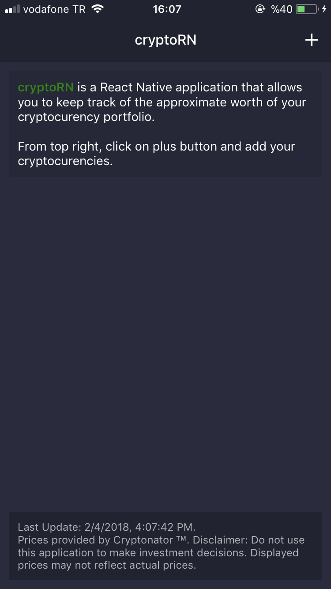
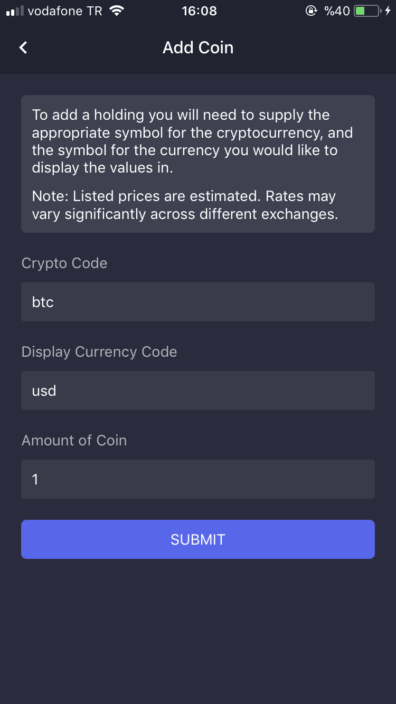
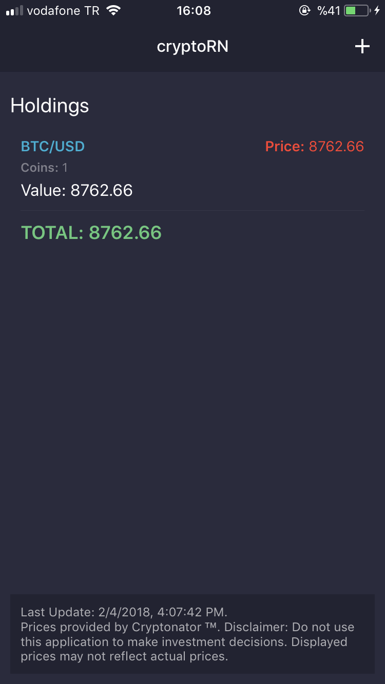
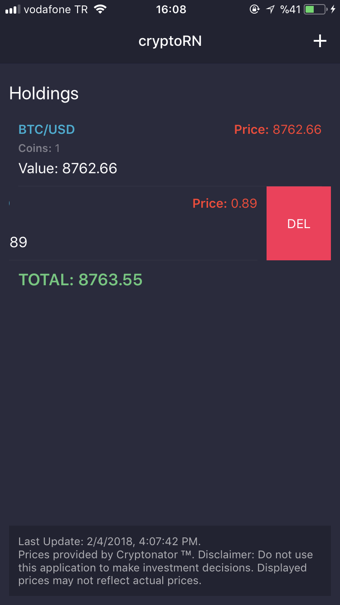

# cryptoRN

cryptoRN is a React Native application that allows you to keep track of the approximate worth of your cryptocurency portfolio.

# Snapshots

## License

This project is licensed under the MIT License - see the [LICENSE.md](LICENSE.md) file for details

## License
MIT license